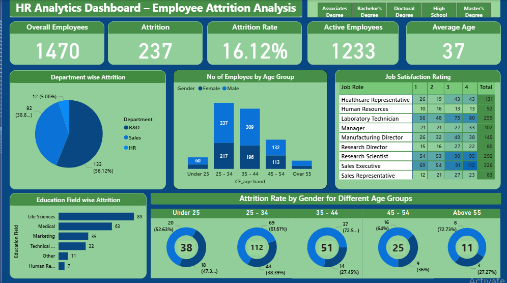

# hr-attrition-analysis
## Dashboard Preview

# HR Analytics — Employee Attrition Analysis

## Overview
Analyzed HR data of 1,470 employees to identify attrition patterns 
across departments, age groups, gender, education, and job roles.

## Key Findings
- Total Employees: 1,470
- Attrition: 237 employees (16.12%)
- Active Employees: 1,233
- Average Age: 37
- Highest Attrition: R&D department (133 employees — 56%)
- Highest Age Group: 25-34 years (112 left)
- Highest Job Role: Laboratory Technician (62 left)

## Tools Used
- Excel
- Power BI
- DAX

## Dataset
- 1,470 rows, 41 columns
- 3 departments: R&D, Sales, HR
